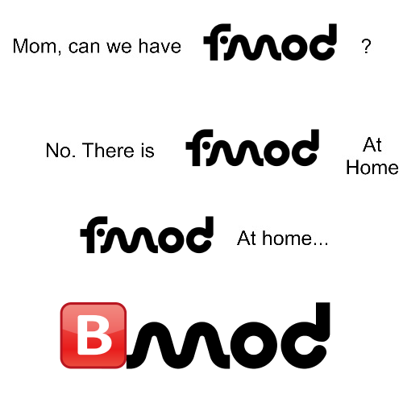
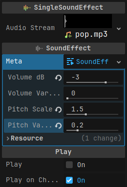
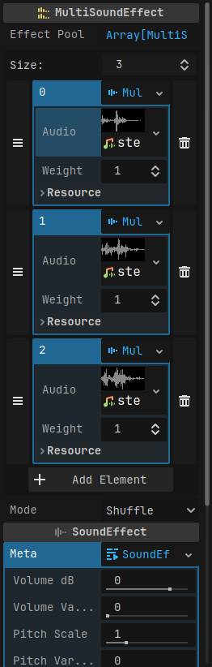
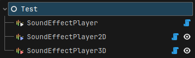
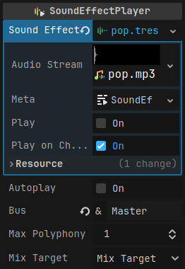
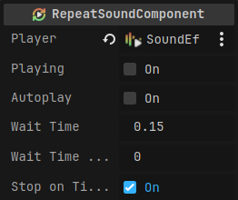

# BMOD

Add-on for Godot 4.2.

## Installation

[Get on Godot Asset Library](https://godotengine.org/asset-library/asset/11761)

Or simply clone the repo and copy the [addons/bmod](addons/bmod) folder into your project. 

## Features

### SoundEffect Resource

- Set volume, volume variation, pitch, and pitch variation on a resource instead of a AudioStreamPlayer Node
- You can preview the sound in the editor. Easy to tweak
- SingleSoundEffect and MultiSoundEffect
	- Both extend the same base class. Where you can use one — you can also use the other 
	- MultiSoundEffect chooses a random sound from a weighted pool of sounds

	
### SoundEffectPlayer Node

- Has the same functionality as AudioStreamPlayer but works with SoundEffect
- Has a 2D and a 3D version

### BMOD Autoload

- A quick way to play SoundEffect without a need for a SoundEffectPlayer
- You can use it to play SoundEffect after you free a scene. For example: when an entity dies
- `play_sfx(...)`, `play_sfx_2d(..., global_position: Vector2, ...)`, `play_sfx_3d(..., global_position: Vector3, ...)`

### RepeatSoundComponent Node

- Useful when you want to repeat a sound
- Uses duck typing. You can use it with any of the AudioStreamPlayer or SoundEffectPlayer nodes
	- It just calls `play(...)` and `stop()` methods
- You can preview the sound in the editor. Easy to tweak
	
## Project Settings
- `audio/sfx_manager/default_sfx_bus`
	- The Audio Bus that will be used by default on SoundEffectPlayer and in SfxManager
